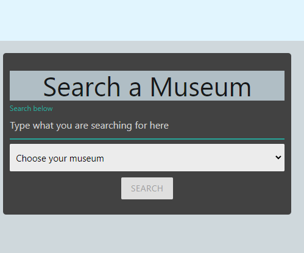
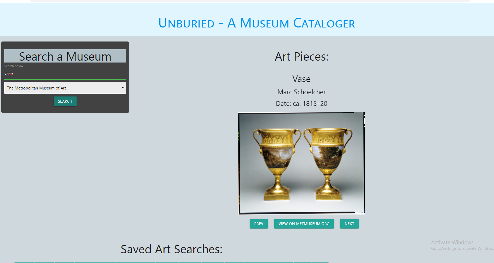
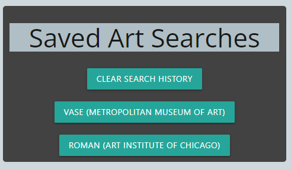

Unburied Museum Cataloger

Description:

This is the Unburied Museum Cataloger. You can search a veriety of art from the Metropolitan Museum of Art and the Chicago Art Institute. Your search history will be saved so you can revisit your favorite art peices.

## Installation:

The Application will be deployed through github pages.

## Usage:

First, the user will navigate to the search bar. They will select a museum and input a keyword they would like to search for.

Then, the user will be presented with images related to thier search, along with the artist and the date it was made. They will use the "PREV" AND "Next" buttons to view the selection of art. When the middle button is clicked, the user can view the art piece on its original website.

The user's unput will be saved so they can revisit thier searches.

    

## Built-With:

1.[Materialize](https://materializecss.com/)
2.[JQuery](https://jquery.com/)

## Collaborators:

[Noah](https://github.com/PierTwo)
[Ryan](https://github.com/nuglah)
[Jordan](https://github.com/jordanb366)
[Mya](https://github.com/Myajewell)