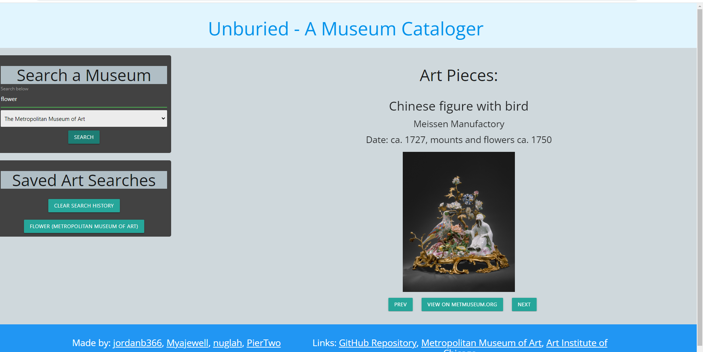

# Unburied Museum Cataloger

## Description:

This is the Unburied Museum Cataloger. You can search a variety of art from the Metropolitan Museum of Art and the Chicago Art Institute. Your search history will be saved so you can revisit your favorite art peices.

## Installation:

The Application is deployed through [GitHub Pages](https://piertwo.github.io/unburied-museum-cataloger/).

## Usage:

First, the user will navigate to the search bar. They will select a museum and input a keyword they would like to search for.

Then the user will be presented with images related to their search as well as the artist name and the date it was made. They will use the "PREV" AND "Next" buttons to view the selection of art. When the middle button is clicked, the user can view the art piece on its original website.

The user's input will be saved so they can revisit their searches by clicking on the button with the name of their search.

## Built-With:

1. [Materialize](https://materializecss.com/)
2. [JQuery](https://jquery.com/)
3. [Google Fonts](https://fonts.google.com/)
4. [The Metropolitan Museum of Art Collection API](https://metmuseum.github.io/)
5. [Art Institute of Chicago Public API](https://www.artic.edu/open-access/public-api)

## Collaborators:

- [Noah](https://github.com/PierTwo)
- [Ryan](https://github.com/nuglah)
- [Jordan](https://github.com/jordanb366)
- [Mya](https://github.com/Myajewell)